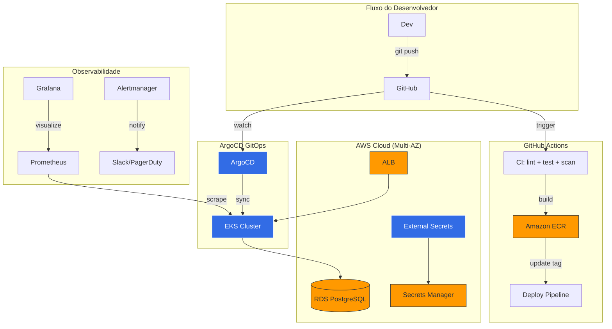

# ✨ EKS GitOps Platform

> Plataforma de entrega contínua que vai do `git push` até o pod rodando em produção — sem tocar no cluster manualmente, sem secrets expostos, sem surpresas.

[](https://github.com/J0wSSilva/eks-gitops-platform/actions/workflows/ci.yml)
[](https://github.com/J0wSSilva/eks-gitops-platform/actions/workflows/deploy.yml)
[](https://github.com/J0wSSilva/eks-gitops-platform/actions/workflows/terraform.yml)
[](https://opensource.org/licenses/MIT)
[](https://www.terraform.io/)
[](https://kubernetes.io/)
[](https://argoproj.github.io/cd/)

---

## 📋 Índice

- [Quick Start](#-quick-start-rode-em-5-minutos)
- [O que é isso?](#-o-que-é-isso)
- [Arquitetura](#-arquitetura)
- [O que vem pronto](#-o-que-vem-pronto)
- [Stack Tecnológica](#-stack-tecnológica)
- [Estrutura do Projeto](#-estrutura-do-projeto)
- [Ambientes](#-ambientes)
- [Fluxo GitOps](#-fluxo-gitops)
- [Observabilidade](#-observabilidade)
- [Segurança](#-segurança)
- [Custos Estimados](#-custos-estimados)
- [Deploy em Produção](#-deploy-em-produção-aws)
- [Troubleshooting](#-troubleshooting)
- [Contribuindo](#-contribuindo)
- [Licença](#-licença)

---

## 🚀 Quick Start (rode em 5 minutos)

Não precisa de conta AWS. Tudo roda na sua máquina com Docker.

```bash
# Clone o repositório
git clone https://github.com/J0wSSilva/eks-gitops-platform.git
cd eks-gitops-platform

# Sobe tudo: MiniStack (AWS local) + Kind (K8s) + ArgoCD + App
cd local && ./setup-local.sh
```

Quando terminar, você terá:

| O que                | Onde acessar                           |
| -------------------- | -------------------------------------- |
| **Pod Dashboard**    | http://localhost:8081                   |
| **ArgoCD UI**        | https://localhost:9090                  |
| **AWS Local**        | http://localhost:4566/_ministack/health |

```bash
# Port-forwards (se não estiverem ativos)
kubectl -n argocd port-forward svc/argocd-server 9090:443 &
kubectl -n demo-app port-forward svc/demo-app 8081:80 &

# Destruir tudo quando quiser
./cleanup-local.sh
```

**Pré-requisitos:** Docker, kubectl, kind, terraform, tflocal (`pip install terraform-local`)

---

## 💡 O que é isso?

Uma arquitetura de referência para times de Platform Engineering. Você faz push no Git, e o resto acontece sozinho:

1. **CI** roda lint, testes, scan de segurança e build da imagem
2. **ArgoCD** detecta a mudança nos manifests e sincroniza com o cluster
3. **Kubernetes** faz rolling update sem downtime
4. **Prometheus** monitora tudo, dispara alertas se algo sair do normal

Funciona para times de 3 ou 30 pessoas. O código que roda em dev é o mesmo que roda em prod — muda só o tamanho das máquinas e quem pode aprovar o deploy.

---

## 🏗 Arquitetura



Para diagramas detalhados (topologia de rede, fluxo de sequência, isolamento por ambiente), veja [docs/architecture.md](docs/architecture.md).

---

## 🎯 O que vem pronto

### Infraestrutura como Código

- **Módulos Terraform** parametrizados para VPC, EKS, ECR e RDS
- **3 ambientes** isolados com VPCs e CIDRs distintos (dev/staging/prod)
- **State remoto** no S3 com lock via DynamoDB, separado por ambiente
- **Custo otimizado** desde o início: Spot instances, NAT compartilhado fora de prod, storage gp3

### GitOps e Entrega Contínua

- **ArgoCD com App of Apps** — um único ponto de entrada gerencia tudo
- **ApplicationSets** — descobre ambientes automaticamente, gera 1 Application por overlay
- **Kustomize overlays** — base compartilhada + patches por ambiente, sem Helm
- **Promoção progressiva:** dev (auto) → staging (auto) → prod (aprovação manual)

### Pipelines CI/CD

- **OIDC Federation** entre GitHub e AWS — sem access keys de longa duração
- **Builds em paralelo** com matrix Terraform por ambiente
- **Scan de segurança** com Trivy + lint com ruff em todo PR
- **Terraform plan** aparece como comentário automático no PR

### Segurança (Zero Trust)

- **Network Policies** deny-all por padrão, regras explícitas de allow
- **RBAC progressivo:** dev (acesso total) → staging (view+debug) → prod (read-only)
- **External Secrets Operator** integrando AWS Secrets Manager via IRSA
- **Criptografia KMS** em secrets do EKS, volumes EBS, storage do RDS
- **Containers seguros:** non-root, read-only filesystem, Trivy no CI

### Observabilidade

- **kube-prometheus-stack:** Prometheus + Grafana + Alertmanager
- **Dashboards prontos:** Cluster Health + Application RED metrics + SLO tracking
- **20 regras de alerta** cobrindo SLOs, pods, nodes e sync do ArgoCD
- **Logging estruturado** em JSON (pronto para Loki)

---

## 🔧 Stack Tecnológica

| Camada        | Tecnologia                                    | Versão                     |
| ------------- | --------------------------------------------- | -------------------------- |
| Cloud         | AWS (EKS, ECR, RDS, S3, KMS, Secrets Manager) | —                          |
| IaC           | Terraform                                     | >= 1.7                     |
| Orquestração  | Kubernetes (EKS)                              | 1.29                       |
| GitOps        | ArgoCD                                        | v3                         |
| CI/CD         | GitHub Actions                                | OIDC                       |
| Manifestos    | Kustomize                                     | Built-in                   |
| Monitoramento | Prometheus + Grafana                          | kube-prometheus-stack 58.x |
| Alertas       | Alertmanager → Slack / PagerDuty              | —                          |
| Secrets       | External Secrets Operator                     | v1beta1                    |
| Aplicação     | Python 3.12 (Pod Dashboard)                   | stdlib only                |
| Segurança     | Network Policies + RBAC + KMS                 | —                          |

---

## 📁 Estrutura do Projeto

```
eks-gitops-platform/
│
├── app/                          # Aplicação demo (Pod Dashboard)
│   ├── server.py                 # Servidor HTTP com métricas do pod (zero deps)
│   ├── Dockerfile                # Build produção (multi-stage, distroless)
│   ├── Dockerfile.local          # Build local (alpine, healthcheck)
│   ├── src/                      # Módulos da aplicação (routes, config)
│   └── tests/                    # Testes automatizados (pytest)
│
├── terraform/                    # Infraestrutura AWS
│   ├── modules/
│   │   ├── vpc/                  # VPC Multi-AZ (subnets pub/priv/db)
│   │   ├── eks/                  # Cluster EKS + OIDC + node groups + KMS
│   │   ├── ecr/                  # Registries com lifecycle policies
│   │   └── rds/                  # PostgreSQL + integração Secrets Manager
│   └── environments/
│       ├── dev/                  # t3.medium, 2 nodes — ~$170/mês
│       ├── staging/              # t3.large, spot — ~$270/mês
│       ├── prod/                 # m5.xlarge, multi-AZ — ~$530/mês
│       └── local/                # MiniStack (emula AWS, custo $0)
│
├── kubernetes/                   # Manifests Kubernetes
│   ├── base/                     # Kustomize base (deploy, svc, ingress, HPA)
│   ├── overlays/                 # Patches por ambiente (dev/staging/prod/local)
│   └── argocd/
│       ├── install/              # Helm values do ArgoCD
│       └── apps/                 # App of Apps + ApplicationSets
│
├── security/                     # Políticas de segurança
│   ├── rbac/                     # Roles progressivas (dev=full, prod=ro)
│   ├── network-policies/         # Deny-all + regras explícitas
│   └── external-secrets/         # ClusterSecretStore + ExternalSecrets
│
├── observability/                # Stack de monitoramento
│   ├── kube-prometheus-stack/    # Helm values (Prometheus + Grafana)
│   ├── dashboards/               # JSON Grafana (cluster + app)
│   └── alerts/                   # 20 alertas customizados (PrometheusRule)
│
├── local/                        # Ambiente local (sem cloud)
│   ├── setup-local.sh            # Bootstrap completo com 1 comando
│   ├── cleanup-local.sh          # Teardown
│   ├── kind-config.yaml          # Cluster Kind (1 cp + 2 workers)
│   └── docker-compose.local.yml  # MiniStack com persistência
│
├── .github/workflows/            # Pipelines CI/CD
│   ├── ci.yml                    # Lint → Test → Scan → Build+Push ECR
│   ├── deploy.yml                # Deploy progressivo com approval gates
│   └── terraform.yml             # Plan/apply por ambiente (matrix)
│
└── docs/
    └── architecture.md           # Diagramas detalhados (Mermaid)
```

---

## 🌍 Ambientes

Cada ambiente tem sua própria VPC, configuração de nodes e política de deploy. Dev é barato e permissivo; prod é resiliente e controlado.

|              | Dev                    | Staging                 | Prod                     | Local               |
| ------------ | ---------------------- | ----------------------- | ------------------------ | ------------------- |
| **VPC CIDR** | `10.10.0.0/16`         | `10.20.0.0/16`          | `10.30.0.0/16`           | `10.99.0.0/16`      |
| **Nodes**    | 2× t3.medium (OD)      | 2-4× t3.large (Spot+OD) | 3-6× m5.xlarge (Spot+OD) | Kind (3 containers) |
| **NAT**      | Single AZ              | Single AZ               | Multi-AZ (HA)            | N/A                 |
| **RDS**      | Single-AZ db.t3.medium | Single-AZ db.t3.large   | Multi-AZ db.r6g.large    | MiniStack           |
| **Replicas** | 1                      | 2                       | 3-10 (HPA)               | 3                   |
| **Deploy**   | Auto on push           | Auto on merge           | Aprovação manual         | Manual              |
| **RBAC**     | Acesso completo        | View + debug            | Read-only                | Full                |
| **Custo**    | ~$170/mês              | ~$270/mês               | ~$530/mês                | $0                  |

---

## 🔄 Fluxo GitOps

```
Push no repositório
        │
        ▼
┌─────────────────────────────┐
│  GitHub Actions (CI)        │
│  • Lint com ruff            │
│  • Testes + cobertura       │
│  • Scan Trivy (segurança)   │
│  • Build + push para ECR    │
└─────────────┬───────────────┘
              │ Atualiza image tag no kustomization.yaml
              ▼
┌─────────────────────────────┐
│  ArgoCD detecta mudança     │
│  • Compara desired vs live  │
│  • Aplica diff no cluster   │
│  • Reporta saúde            │
└─────────────┬───────────────┘
              │
              ▼
┌─────────────────────────────┐
│  Rolling Update (K8s)       │
│  • Zero downtime            │
│  • Readiness probe = gate   │
│  • Rollback automático      │
└─────────────────────────────┘
```

**Caminho de promoção:** `dev` (auto) → `staging` (auto) → `prod` (aprovação manual)

---

## 📊 Observabilidade

### Dashboards Grafana

| Dashboard               | O que mostra                                                        |
| ----------------------- | ------------------------------------------------------------------- |
| **Cluster Health**      | CPU, memória, disco dos nós + status dos pods + latência API server |
| **Application Metrics** | Rate / Errors / Duration (RED) + SLO tracking + error budget        |

### Alertas (20 regras)

| Grupo               | O que detecta                                             | Severidade       |
| ------------------- | --------------------------------------------------------- | ---------------- |
| `application.slo`   | Error rate alto, latência P99 acima do SLO, burn rate     | Critical         |
| `pod.health`        | CrashLoop, OOMKilled, réplicas divergentes do desejado    | Critical/Warning |
| `node.health`       | Nó offline, CPU > 85%, memória > 90%                      | Critical/Warning |
| `argocd.health`     | App fora de sync, saúde degradada, sync falhando          | Critical/Warning |
| `capacity.planning` | HPA no máximo de réplicas, PVC quase cheio                | Warning          |

---

## 🔒 Segurança

A plataforma segue o modelo Zero Trust: nada é confiável até que se prove o contrário.

| Controle                      | Como funciona                                                 |
| ----------------------------- | ------------------------------------------------------------- |
| **Sem credenciais estáticas** | GitHub OIDC assume IAM roles temporárias (15 min)             |
| **Secrets seguros**           | External Secrets Operator puxa do AWS Secrets Manager via IRSA |
| **Rede isolada**              | NetworkPolicies negam tudo; regras explícitas liberam o mínimo |
| **Menor privilégio**          | RBAC escala: dev (full) → staging (view) → prod (read-only)   |
| **Criptografia em repouso**   | KMS para secrets do K8s, EBS e RDS                            |
| **Container seguro**          | Non-root, filesystem read-only, sem capabilities extras        |

---

## 💰 Custos Estimados

| Ambiente    | Custo/mês | Composição principal                                              |
| ----------- | --------- | ----------------------------------------------------------------- |
| **Dev**     | ~$170     | EKS control plane ($73) + 2 nodes ($60) + RDS ($30)               |
| **Staging** | ~$270     | EKS ($73) + 3 nodes spot ($90) + RDS ($50) + NAT ($45)            |
| **Prod**    | ~$530     | EKS ($73) + 4 nodes ($180) + RDS Multi-AZ ($120) + 3 NATs ($135)  |
| **Local**   | $0        | MiniStack + Kind (roda tudo na sua máquina)                       |
| **Total**   | ~$970/mês | Plataforma completa (3 ambientes cloud)                           |

> 💡 **Otimizações já aplicadas:** Spot instances (60-70% de economia), NAT único fora de prod, storage gp3, instâncias dimensionadas por ambiente.

---

## ☁️ Deploy em Produção (AWS)

### Pré-requisitos

- AWS CLI v2 configurado com permissões adequadas
- Terraform >= 1.7.0
- kubectl >= 1.29
- Docker

### Passo a passo

```bash
# 1. Provisionar infraestrutura
cd terraform/environments/dev
terraform init
terraform plan -out=tfplan
terraform apply tfplan

# 2. Configurar kubectl
aws eks update-kubeconfig \
  --name eks-gitops-dev \
  --region us-east-1 \
  --alias eks-dev

# 3. Instalar ArgoCD
kubectl create namespace argocd
helm repo add argo https://argoproj.github.io/argo-helm
helm install argocd argo/argo-cd \
  --namespace argocd \
  --values kubernetes/argocd/install/values.yaml

# 4. Bootstrap do App of Apps
kubectl apply -f kubernetes/argocd/apps/app-of-apps.yaml

# 5. Validar
argocd app list
kubectl get pods -n dev
```

---

## ⚠️ Troubleshooting

| Problema | Causa provável | Solução |
| -------- | -------------- | ------- |
| ArgoCD mostra "Progressing" | Ingress sem LoadBalancer IP (Kind) | Health customization para Ingress no `argocd-cm` |
| Pod em `ImagePullBackOff` | Imagem não carregada no Kind | `kind load docker-image  --name eks-gitops-local` |
| Terraform "connection refused" | MiniStack não rodando | `docker compose -f local/docker-compose.local.yml up -d` |
| ArgoCD "OutOfSync" | Manifests locais divergem do Git | `git push` ou sync manual pelo ArgoCD |
| Port-forward morre | Timeout de inatividade | Recriar: `kubectl -n <ns> port-forward svc/<svc> <port> &` |

---

## 🤝 Contribuindo

1. Fork o repositório
2. Crie uma branch: `git checkout -b feature/minha-feature`
3. Commit com mensagem clara: `git commit -m 'feat: adiciona feature X'`
4. Push e abra um Pull Request

O CI vai rodar lint, testes e scan automaticamente. Se passar, é só esperar o review.

---

## 📄 Licença

MIT — veja [LICENSE](LICENSE) para detalhes.

---

## Autor

**Jonathan Silva** — Senior DevOps/SRE Engineer

- GitHub: [@J0wSSilva](https://github.com/J0wSSilva)
- Projetos: [datadog-observability](https://github.com/J0wSSilva/datadog-observability) | [Infra-as-Code](https://github.com/J0wSSilva/Infra-as-Code)

---

<p align="center">
  <sub>Construído com Terraform, Kubernetes, ArgoCD e bastante café ☕</sub>
</p>
