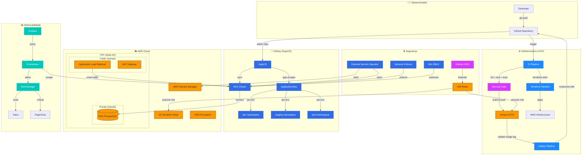
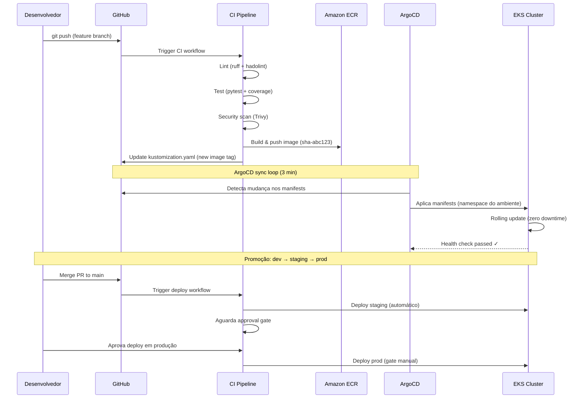
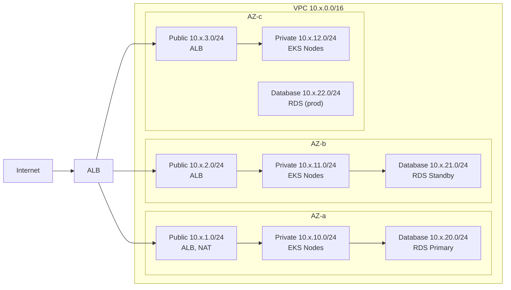

# 🏗 Arquitetura

> Visão completa de como as peças se encaixam — do commit do desenvolvedor até o pod rodando no cluster.

---

## 📋 Índice

- [Visão Geral](#visão-geral)
- [Fluxo GitOps (Detalhado)](#-fluxo-gitops-detalhado)
- [Topologia de Rede](#-topologia-de-rede)
- [Isolamento por Ambiente](#-isolamento-por-ambiente)
- [Stack Tecnológica](#-stack-tecnológica)
- [Arquitetura Local](#-arquitetura-local)

---

## Visão Geral

O diagrama abaixo mostra todas as camadas da plataforma e como elas se conectam:



---

## 🔄 Fluxo GitOps (Detalhado)

O que acontece em cada etapa, desde o push até o pod novo receber tráfego:



### Por que GitOps?

- **Auditabilidade**: todo deploy tem um commit associado
- **Rollback trivial**: `git revert` desfaz qualquer mudança
- **Consistência**: o cluster sempre reflete o que está no Git
- **Segurança**: ninguém precisa de `kubectl` em produção

---

## 🌐 Topologia de Rede

Cada ambiente tem uma VPC isolada com 3 Availability Zones. O tráfego segue um caminho bem definido:



### Decisões de design

- **Subnets públicas** só têm ALB e NAT Gateway — nenhum pod roda aqui
- **Subnets privadas** hospedam os nodes EKS — sem acesso direto da internet
- **Subnets database** são ainda mais isoladas — só pods com Network Policy podem acessar
- **NAT Gateway** permite que pods busquem imagens do ECR e façam chamadas externas

---

## 🏢 Isolamento por Ambiente

| Aspecto     | Dev                       | Staging                  | Prod                     |
| ----------- | ------------------------- | ------------------------ | ------------------------ |
| VPC CIDR    | `10.10.0.0/16`            | `10.20.0.0/16`           | `10.30.0.0/16`           |
| Node Type   | `t3.medium`               | `t3.large`               | `m5.xlarge`              |
| Node Count  | 2 (ON_DEMAND)             | 2-4 (SPOT + OD)          | 3-6 (SPOT + OD)          |
| NAT Gateway | Single                    | Single                   | Multi-AZ                 |
| RDS         | Single-AZ, `db.t3.medium` | Single-AZ, `db.t3.large` | Multi-AZ, `db.r6g.large` |
| Replicas    | 1                         | 2                        | 3-10 (HPA)               |
| Deploy Gate | Automático                | Automático               | Aprovação manual         |
| RBAC (devs) | Acesso total              | View + debug             | Read-only                |
| Custo est.  | ~$170/mês                 | ~$270/mês                | ~$530/mês                |

### Filosofia

- **Dev** existe para quebrar coisas rápido e aprender — nada é sagrado aqui
- **Staging** é onde validamos que tudo funciona junto antes de ir para prod
- **Prod** é conservador por design — deploy manual, menos permissões, mais réplicas

---

## 🔧 Stack Tecnológica

| Camada        | Tecnologia                   | Papel na plataforma              |
| ------------- | ---------------------------- | -------------------------------- |
| IaC           | Terraform 1.7+               | Provisiona e versiona infra      |
| Cloud         | AWS (EKS, ECR, RDS, S3, KMS) | Hospeda tudo                     |
| Orquestração  | Kubernetes 1.29 (EKS)        | Roda e escala os containers      |
| GitOps        | ArgoCD v3                    | Mantém cluster sincronizado      |
| CI/CD         | GitHub Actions               | Automatiza build, test e deploy  |
| Aplicação     | Python 3.12                  | App demo (Pod Dashboard)         |
| Observability | Prometheus + Grafana         | Métricas, dashboards e alertas   |
| Secrets       | External Secrets Operator    | Injeta secrets de forma segura   |
| Segurança     | Network Policies + RBAC      | Zero Trust por padrão            |

---

## 🏠 Arquitetura Local

Para quem quer explorar sem conta AWS. O `setup-local.sh` provisiona tudo isso:

```
┌─────────────────────────────────────────────────────────┐
│  localhost                                               │
│                                                         │
│  ┌─────────────┐    ┌──────────────────────────────┐   │
│  │  MiniStack  │    │  Kind Cluster                │   │
│  │  :4566      │    │                              │   │
│  │             │    │  ┌────────┐  ┌───────────┐   │   │
│  │  • VPC      │    │  │ ArgoCD │  │ Pod       │   │   │
│  │  • EKS      │    │  │ :9090  │  │ Dashboard │   │   │
│  │  • ECR      │    │  └────────┘  │ :8081     │   │   │
│  │  • RDS      │    │              └───────────┘   │   │
│  │  • IAM      │    │                              │   │
│  │  • S3       │    │  control-plane + 2 workers   │   │
│  └─────────────┘    └──────────────────────────────┘   │
│                                                         │
│  Terraform (tflocal) ──→ MiniStack                      │
│  Kustomize           ──→ Kind                           │
└─────────────────────────────────────────────────────────┘
```

| Componente            | Ferramenta     | Detalhes                             |
| --------------------- | -------------- | ------------------------------------ |
| AWS (49 serviços)     | MiniStack v1.3 | VPC, EKS, ECR, RDS, IAM, S3, etc.   |
| Cluster Kubernetes    | Kind           | 1 control-plane + 2 workers (v1.35)  |
| GitOps                | ArgoCD         | UI em https://localhost:9090         |
| Aplicação             | Pod Dashboard  | Métricas reais do pod em tempo real  |
| Infra                 | tflocal        | 46 recursos Terraform locais         |

### Comandos úteis

```bash
# Subir do zero
cd local && ./setup-local.sh

# Verificar saúde do MiniStack
curl http://localhost:4566/_ministack/health

# Terraform local
cd terraform/environments/local
tflocal plan
tflocal apply -auto-approve

# Derrubar tudo
cd local && ./cleanup-local.sh
```

---

<p align="center">
  <a href="../README.md">← Voltar ao README principal</a>
</p>
